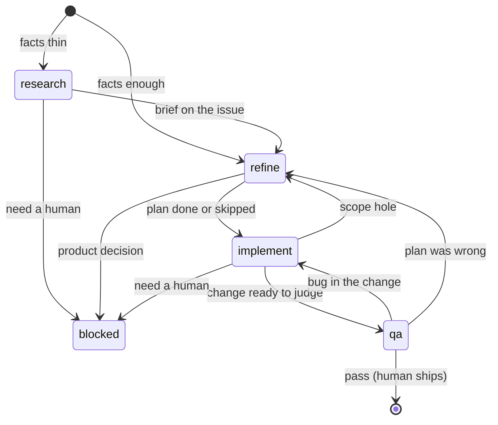

# Workflow

Pipeline on **`phase:*`**. Claim overlay on **`status:*`**. Writing a product plan is **refine**, not its own phase.

`status:doing` may sit on any phase while someone is working. `status:open` when available. `status:blocked` / `status:duplicate` as defined in `SKILL.md`.

## Skip matrix

| `type:*` | Research | Plan file | Hardening |
| -------- | -------- | --------- | --------- |
| `nit` | Skip | Skip (`plan skipped: trivial`) | Skip (`hardening skipped: trivial`) |
| `fix` | Skip if repro + expected/actual are clear | Skip if the issue body *is* the plan | Light (see `refine.md`) |
| `feat` | If facts are thin | If the issue body cannot hold a complete plan | Full, unless an explicit skip |

Escalate hardening (treat like feat) when the change is **cross-cutting**, **data-model / migration**, or **external-API / rate-limit sensitive**.

Oversized feat: **split into more issues**, each with its own plan or skip. Do not add a parent PRD.
